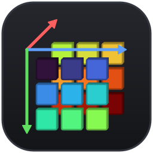
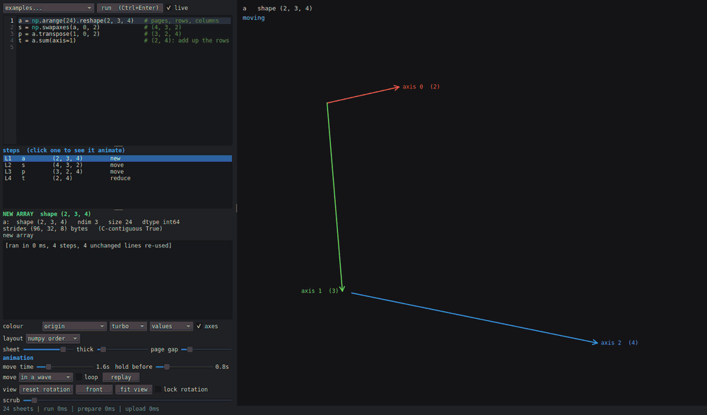
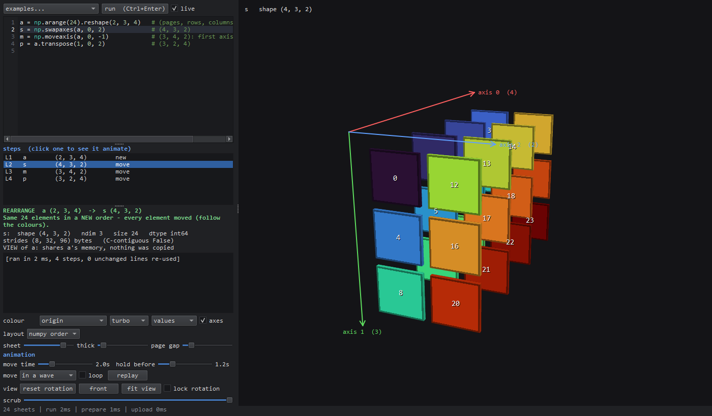
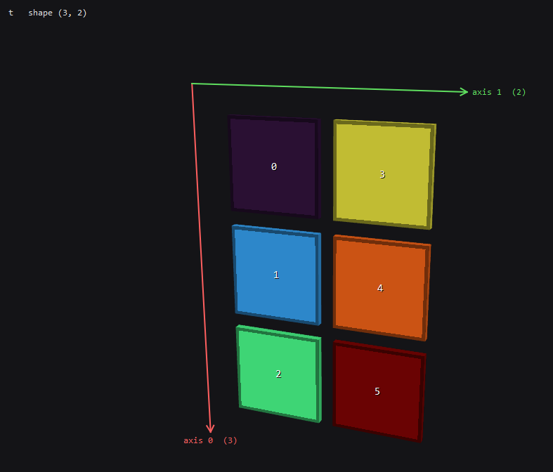
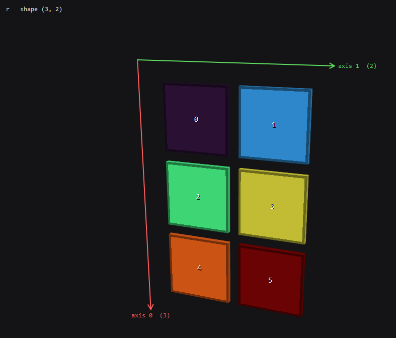
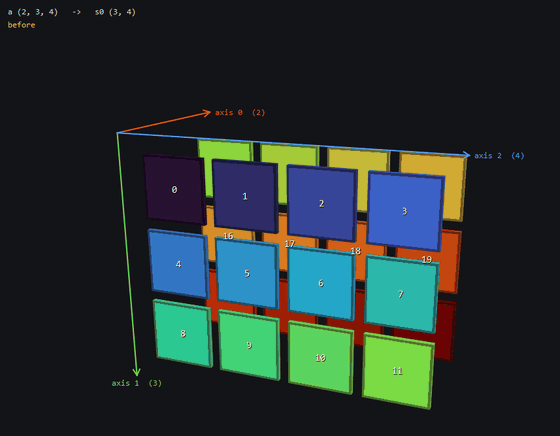
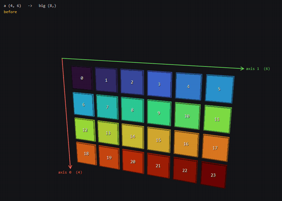
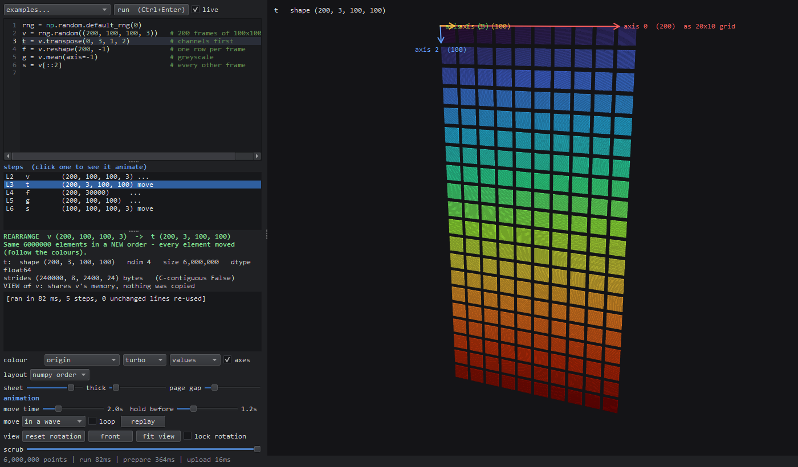
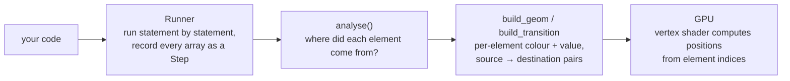

<div align="center">



# npviz

**Type numpy code on the left, watch every array move on the right.**

npviz runs your numpy code line by line and draws every array as a stack of 3D sheets.
Click any step and the elements fly from the array they came from into their new places,
so you can *see* what `reshape`, `.T`, `swapaxes`, slicing, `stack` or `sum(axis=1)` actually do.

[](LICENSE)




</div>

---

## Contents

- [Why](#why)
- [Features](#features)
- [Install](#install)
- [Usage](#usage)
- [Reading the picture](#reading-the-picture)
- [Examples](#examples)
- [How it works](#how-it-works)
- [Controls](#controls)
- [Limitations](#limitations)
- [Contributing](#contributing)
- [License](#license)

## Why

Shape bugs are some of the most common bugs in numpy code, and they're hard to reason about
from `print(a.shape)` alone. Questions like these are easy to get wrong:

- Is `a.reshape(3, 2)` the same as `a.T` when `a` is `(2, 3)`? (No. Same shape, different order.)
- What does `np.moveaxis(a, 0, -1)` do to element `a[1, 2, 3]`?
- Which elements end up in `a.sum(axis=1)[0, 2]`?
- Did that line copy my 2 GB array or return a view?

npviz answers them visually. Every element keeps its colour as it moves, so you can follow it
through any number of reshapes, transposes and slices.

## Features

- **Live editor.** Write ordinary numpy (`np` is already imported). The code re-runs half a second after you stop typing.
- **Every array is a step.** Each array your code creates or changes in place shows up in the step list. A bare expression such as `b.T` gets a step too.
- **Animated transitions.** Click a step to watch its elements travel from the source array. Elements can move in a wave, all together, or one by one, and a scrub slider lets you drag through the animation by hand.
- **Plain-English explanations.** Each step is labelled `RESHAPE`, `REARRANGE`, `SELECT`, `COMBINE`, `COPY`, `REDUCE`, `ELEMENTWISE` or `NEW ARRAY`, with a sentence describing what happened. The panel also shows shape, strides, contiguity, and whether the result is a **view** (shared memory) or a **copy**.
- **Hover any sheet** to see its index and value, and which element of which array it came from (`s[3, 1, 0] = 3  <- a[0, 1, 3]`). For reductions it shows the slice that was reduced (`= sum(a[:, 1, 2])`).
- **Several colour modes:** by origin (follows elements around), by value, by flat index, or by index along a chosen axis. Three colour maps: turbo, viridis and paper.
- **Big arrays.** Up to 300k elements are drawn as shaded 3D sheets and up to 8 million as GPU points. Beyond that, every k-th element per axis is shown. Positions are computed on the GPU, so a still array costs only 8 bytes per element of upload.
- **Up to 12 dimensions.** Axes beyond the third are laid out as blocks side by side, below, and behind, then repeat.
- **Never freezes.** Your code runs on a background thread, and only the lines after your first edit are re-executed.

## Install

You need Python 3.9+ and a GPU/driver with **OpenGL 3.3** (anything from the last decade, integrated graphics included).

```bash
git clone https://github.com/shrike99/numpy-visualizer.git
cd numpy-visualizer
pip install -r requirements.txt
```

The dependencies are just [numpy](https://numpy.org), [PyQt6](https://pypi.org/project/PyQt6/) and [moderngl](https://github.com/moderngl/moderngl).
npviz is a single file, [`npviz.py`](npviz.py), so you can also copy that file anywhere and run it.

> Tested on Windows 11 with Python 3.12, numpy 2.2, PyQt6 6.10 and moderngl 5.12.
> On Linux, npviz falls back to `libGL.so.1` / EGL automatically if moderngl can't find the Qt context on its own.

## Usage

```bash
python npviz.py                          # opens with the "reshape basics" example
python npviz.py examples/sorting.py      # opens with your own script in the editor
```



| Area | What it does |
| --- | --- |
| **Editor** (top left) | Your code. `Ctrl+Enter` runs it; with **live** ticked it runs on its own. The selected step's line is highlighted, and an error line turns red. |
| **Steps** | One row per array: line number, name, shape and kind. Click a row (or use the arrow keys in the 3D view) to animate it. |
| **Explanation** | What the step did, in words, plus shape, ndim, size, dtype, strides, contiguity, and whether it's a view or a copy. |
| **Console** | `print()` output, non-array results (`a.shape  ->  (2, 3, 4)`), errors, and timing. |
| **Settings** | Colour mode, colour map, labels (values / indices / none), axis arrows, layout, sheet size and thickness, page gap, and animation speed / hold / style / loop. |
| **3D view** | Drag to rotate and scroll to zoom. Hover a sheet for details at the bottom of the window. |

## Reading the picture

Each element is a thin sheet. The layout follows the way `print(a)` reads:

| Axis | Direction |
| --- | --- |
| last axis | columns, left → right |
| 2nd-last | rows, top → bottom |
| 3rd-last | pages, front → back |
| 4th-last and beyond | whole blocks side by side, then below, then behind, and so on (large counts wrap into a grid) |

Coloured arrows from the corner of element `[0, 0, ...]` label each axis with its index and length.

Switch **layout** to **image order** for arrays shaped like images, `(height, width, channels)`.
Axis 0 becomes rows, axis 1 columns and axis 2 pages, so a picture looks like a picture.

### Colour modes

| Mode | Colour means |
| --- | --- |
| **origin** *(default)* | Where the element started. The colour sticks to the element through every move, so you can track it. Elements with no source (e.g. padding) are grey. |
| **value** | The element's value, on **one** scale shared by every step, so `a * 2` visibly changes colour. |
| **value per array** | The element's value, stretched over the full colour range for each array. |
| **flat index** | Position in memory order (C order). |
| **axis k** | The element's index along axis *k*. Handy for seeing where an axis went after a transpose. |

NaN and ±inf are drawn in magenta.

## Examples

The **examples...** menu has eleven built-in walkthroughs:

| Example | Shows |
| --- | --- |
| reshape basics | `reshape`, `-1`, going back to 1D |
| flatten / ravel | C vs Fortran order, copy vs view |
| transpose vs reshape | same shape, different element order |
| in-place `.shape` | changing a shape without a copy |
| views share memory | writing into `a` shows up in `a.ravel()` but not in `a.flatten()` |
| 3D axes | `swapaxes`, `moveaxis`, `transpose(1, 0, 2)` |
| add / remove axes | `np.newaxis`, `expand_dims`, `squeeze` |
| indexing & slicing | rows, columns, blocks, strides, boolean masks |
| stack / concatenate | joining along existing and new axes |
| sum along an axis | which axis disappears, `keepdims` |
| big: 6 million elements | a `(200, 100, 100, 3)` video tensor, transposed, reshaped and averaged |

There are more scripts in [`examples/`](examples) (`image_channels.py`, `sorting.py`, `tile_repeat_roll.py`) that you can open with `python npviz.py examples/<name>.py`.

### Transpose vs reshape

The classic trap. Both give a `(3, 2)` array from a `(2, 3)` one, but only `.T` moves elements:

```python
a = np.arange(6).reshape(2, 3)
t = a.T                    # rows become columns: elements MOVE
r = a.reshape(3, 2)        # same shape as a.T, but elements keep their order!
```

| `t = a.T` | `r = a.reshape(3, 2)` |
| :---: | :---: |
|  |  |
| `REARRANGE`: every element moved | `RESHAPE`: same order, just cut differently |

### Reductions

`a.sum(axis=0)` on a `(2, 3, 4)` array: the two pages slide into each other and merge. Hover
an output sheet and npviz tells you exactly which slice it summed (`= sum(a[:, 1, 2])`).

```python
a = np.arange(24).reshape(2, 3, 4)
s0 = a.sum(axis=0)         # squash the pages   -> (3, 4)
```



### Boolean masks

`a[a > 15]` keeps only the elements that pass the test and always gives a 1D result. The
dropped elements shrink away, and the survivors line up in order:

```python
a = np.arange(24).reshape(4, 6)
big = a[a > 15]            # boolean mask -> always 1D
```

 15]: 8 elements survive and form a row" width="560">

### Big arrays

Six million float64 elements (`(200, 100, 100, 3)`, 200 frames of 100×100 RGB) transposed to
channels-first. The 200 frames wrap into a 20 × 10 grid, and the whole step runs and renders in
well under a second:



## How it works

npviz is one Python file of roughly 2,500 lines. The work happens in three stages:



### 1. Running your code (`Runner`)

Your code is parsed with `ast` and executed **one top-level statement at a time** in a namespace
that already contains `np`. After each statement, every variable holding a numeric ndarray (or
numpy scalar) that is new or has changed becomes a `Step`. Bare expressions like `b.T` are
evaluated and recorded too.

Some details keep this fast and correct:

- **Incremental re-runs.** The runner snapshots the namespace after every statement. When you
  edit line 7, lines 1–6 are reused as they are, *including their random numbers*, and only
  line 7 onward runs again. If a later line had changed an earlier array in place, the runner
  puts the old contents back before resuming.
- **Copy-on-write, decided statically.** Steps normally hold the *live* array object, so views
  like `reshape`, `.T` and slicing cost no memory. Before each statement, a small AST check
  sorts it into one of three groups. It may be unable to mutate anything (`b = a.T`), it may
  only mutate the arrays it names (`a[0] = 5`, `a.sort()`, `out=`), or it may do anything at
  all (an unknown function call or a `def`). Only the arrays that could change, plus anything
  sharing their memory, get copied first. If they turn out to be unchanged, the copy is thrown
  away again.
- **A timeout.** A `sys.settrace` hook that only watches *your* frames (never numpy's internals)
  stops runaway loops after 10 seconds.

### 2. Working out where each element went (`relate`)

This is the core of npviz. For each step it finds a **provenance array** `prov`, where
`prov[i]` is the flat index of the source element that ended up at output position `i`, or
`-1` if the element is new. It tries these strategies in order:

1. **Reductions.** If the code calls `sum` / `mean` / `max` / `argmax` / ... on the array, npviz
   reads `axis=` from the AST. It then confirms the guess by recomputing a few candidate
   reducers on a small corner of the input and comparing them with the output. That check is
   cheap even for huge arrays.
2. **Sorts.** For `np.sort(a, axis=k)` and `a.sort()`, a stable `argsort` along the same axis
   gives the exact mapping, so equal values never jump between rows.
3. **Value-dependent indexing** (`a[a > 5]`, `a[idx]`). The index key is evaluated on the real
   data and applied to `arange(a.size)` in place of `a`.
4. **Tracing with element IDs.** This is the general trick. npviz re-evaluates your expression
   with every source array **replaced by its own element IDs** (`1, 2, 3, ...` in the same
   shape). Anything that only moves or copies data (reshape, transpose, slicing, `stack`,
   `concatenate`, `repeat`, `tile`, `roll`, `flip`, `pad`, ...) carries those IDs to their
   destinations, so the output *is* the provenance. To make sure arithmetic didn't just happen
   to produce ID-looking numbers, the expression runs a second time with the IDs scrambled by
   an affine bijection `(i·m + c) mod N`. The result is only accepted if the IDs land in
   consistent places and the values match the real output.
5. **Fallbacks.** If the values are identical in the same flat order, it's a reshape. If the
   output holds the same multiset of values, they're matched up as a permutation (shuffles).
   After that come a reduction search, *elementwise* (same shape, values changed), and finally
   *new array*.

The provenance then drives everything else. It tells npviz whether a step is a `RESHAPE`,
`REARRANGE`, `SELECT`, `COMBINE` or `COPY`. It carries the "origin" colours forward from step
to step. It powers the hover text (`<- a[0, 1, 3]`). And it is exactly the list of
(start, end) pairs the animation needs.

The analysis is **lazy**: big steps are only analysed when you click them, and the results are
cached.

### 3. Drawing (`make_layout` + GLSL)

The layout is a closed formula. For element `i` with C-order index `i_k` along axis `k`:

```
position(i) = Σ_k  (i_k mod cols_k) · a_k  +  (i_k div cols_k) · b_k  −  centre
```

`a_k` is the step direction for axis `k` (right, down or back, scaled up for outer block
levels), and `b_k` / `cols_k` wrap long outer axes into a grid. The **vertex shader evaluates
this formula directly** from `gl_InstanceID`/`gl_VertexID`, so no vertex positions are ever
uploaded. Per element the GPU gets only:

- an `RG32F` texture texel holding (colour key, normalised value), which is **8 bytes** for a still array;
- while animating, a second texture for the source array plus an `(sref, dref)` int pair, which comes to **24 bytes**.

Each animated instance interpolates from `layA(sref)` to `layB(dref)` with smoothstep easing
and a per-element delay (the "wave"). It also follows a small sideways arc, so two elements
swapping places don't pass through each other. Elements that appear or disappear scale in or out.
For a reduction, every input element flies to the output cell it was folded into.

Up to 300k elements are drawn as **instanced, lit boxes** (one 36-vertex box per element).
Above that npviz switches to **GL points** sized to match, and above 8M it subsamples every
k-th element per axis.

**Picking** works by rendering the scene a second time into an off-screen buffer, with each
element's ID encoded in the RGBA colour. Reading back the pixel under the mouse gives the
element, with no CPU ray casting. **Labels** (values or indices) are drawn by a transparent Qt
overlay. During an animation, the CPU runs the same layout maths as the shader so the numbers
ride along with their sheets.

### Threading

A single background worker thread runs your code and prepares GPU data. If you type faster than
it can keep up, queued runs are dropped so only the newest one executes, and the UI thread
never blocks on numpy.

## Controls

| Input | Action |
| --- | --- |
| `Ctrl+Enter` | run (not needed with **live** on) |
| left-drag | rotate (pans instead when **lock rotation** is on) |
| right-drag, middle-drag, `Shift`+left-drag | pan |
| mouse wheel | zoom |
| double-click / `F` | fit the array in view and reset the angle |
| `R` | reset rotation (keeps zoom and pan) |
| `Space` | replay the animation |
| `←` `↑` / `→` `↓` | previous / next step |

The keys in the last four rows work while the 3D view has focus (click it first).

## Limitations

- **Your code runs for real**, with the full permissions of the Python process. npviz is a local
  learning and debugging tool, not a sandbox, so don't paste code you don't trust.
- Only **numeric and boolean** arrays are drawn. Complex arrays are shown by magnitude, booleans as 0/1.
- At most **12 dimensions**, **400 steps** per run, and **10 seconds** of run time.
- Element tracking works per top-level statement. A `for` loop that changes an array counts as
  one step, and arithmetic (`a * 2 + 1`) is shown as *elementwise* (values change, nothing moves).
- Steps are found by variable name, so arrays hidden inside lists, dicts or objects aren't drawn.
- Operations that combine values from several arrays, such as `np.where(cond, a, b)`,
  `einsum` or `a @ b`, can't be traced element by element. They show as `ELEMENTWISE` or
  `NEW ARRAY`.

## Project layout

```
npviz.py          the whole app: runner, analysis, layout, shaders, UI
examples/         extra scripts to open with `python npviz.py examples/<file>.py`
assets/           icon (SVG, PNG, ICO)
docs/             screenshots and GIFs used in this README
requirements.txt  numpy, PyQt6, moderngl
```

## Contributing

Issues and pull requests are welcome, especially:

- numpy operations that get the wrong label or no element mapping (please include the snippet);
- rendering problems on your GPU/OS (include the error from the console or terminal);
- new built-in examples that explain a confusing numpy concept.

To try a change, run `python npviz.py` and click through all the built-in examples. The
analysis functions (`run_code`, `analyse`, `relate`) are pure numpy and can be tested without
opening a window:

```python
import npviz
steps, console, err = npviz.run_code("a = np.arange(6).reshape(2, 3)\nt = a.T")
npviz.analyse(steps, 1)
print(steps[1].desc)      # REARRANGE  a (2, 3)  ->  t (3, 2) ...
```

## License

[MIT](LICENSE) © 2026 Mattia Scalzo
