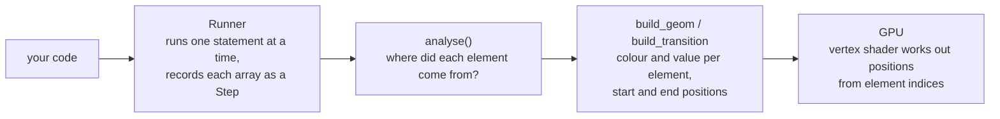

<div align="center">


# npviz

Type numpy code on the left and watch the arrays move on the right.

[](LICENSE)


</div>

npviz runs your numpy code one line at a time and draws every array as a block of little 3D
sheets, one per element. Pick a line and the elements fly out of the array they came from and
land wherever numpy put them. It's meant for those moments when you're staring at a
`reshape` or a `swapaxes` and can't work out where everything went.

## Why

Shape bugs are easy to write in numpy, and `print(a.shape)` only tells you half the story. It
says `(3, 2)` for both `a.T` and `a.reshape(3, 2)`, even though those two arrays hold their
numbers in a completely different order. npviz shows you the order as well as the shape.

A few things it makes obvious:

- `a.reshape(3, 2)` and `a.T` have the same shape but aren't the same array
- where `a[1, 2, 3]` ends up after `np.moveaxis(a, 0, -1)`
- which elements were added together to make `a.sum(axis=1)[0, 2]`
- whether a line copied your array or just handed you a view of it

Each element keeps its colour as it moves, so you can follow one through as many reshapes and
transposes as you like.

## What it does

- The editor re-runs your code half a second after you stop typing. `np` is already imported.
- Every array your code creates, or changes in place, gets a row in the step list. Bare
  expressions like `b.T` count too.
- Clicking a step plays the animation. Elements can move in a wave, all at once or one by one,
  and there's a slider for scrubbing through it by hand.
- Each step gets a label (`RESHAPE`, `REARRANGE`, `SELECT`, `COMBINE`, `COPY`, `REDUCE`,
  `ELEMENTWISE` or `NEW ARRAY`) and a sentence saying what happened. Underneath are the shape,
  strides, whether it's contiguous, and whether it's a view or a copy.
- Hovering over a sheet shows its index, its value and where it came from, for example
  `s[3, 1, 0] = 3  <- a[0, 1, 3]`. For reductions you get the slice that was reduced:
  `= sum(a[:, 1, 2])`.
- You can colour elements by origin, value, flat index or position along one axis, using the
  turbo, viridis or plain "paper" colour maps.
- Big arrays are fine. Up to 300k elements are drawn as shaded sheets and up to 8 million as GPU
  points. Past that it shows every k-th element along each axis.
- It handles up to 12 dimensions. Axes beyond the third are laid out as whole blocks side by
  side, then below, then behind, and round again.
- Your code runs on a background thread, and only the lines from your first edit downwards are
  re-run, so the window doesn't lock up while you type.

## Installing

You'll need Python 3.9 or newer and a graphics driver that supports OpenGL 3.3. Anything from
roughly the last ten years should be fine, integrated graphics included.

```bash
git clone https://github.com/shrike99/numpy-visualizer.git
cd numpy-visualizer
pip install -r requirements.txt
```

That installs [numpy](https://numpy.org), [PyQt6](https://pypi.org/project/PyQt6/) and
[moderngl](https://github.com/moderngl/moderngl). The whole app is one file,
[`npviz.py`](npviz.py), so you can also copy it somewhere else and run it from there.

It's been tested on Windows 11 with Python 3.12, numpy 2.2, PyQt6 6.10 and moderngl 5.12. On
Linux, if moderngl can't find Qt's OpenGL context by itself, npviz tries `libGL.so.1` and then
EGL.

## Using it

```bash
python npviz.py                          # starts with the "reshape basics" example
python npviz.py examples/sorting.py      # starts with your own script loaded
```


The left-hand side, from top to bottom:

| Part | What it's for |
| --- | --- |
| Editor | Your code. `Ctrl+Enter` runs it, or leave "live" ticked and it runs by itself. The line behind the current step is highlighted, and a line that raises an error turns red. |
| Steps | One row per array: line number, name, shape and the kind of step. Click a row to play it, or use the arrow keys in the 3D view. |
| Explanation | What the step did in plain words, plus shape, ndim, size, dtype, strides, contiguity and view or copy. |
| Console | Anything you `print()`, results that aren't arrays (`a.shape  ->  (2, 3, 4)`), errors and timings. |
| Settings | Colour mode and map, labels (values, indices or none), axis arrows, layout, sheet size and thickness, page gap, and how the animation plays. |

The right-hand side is the 3D view. Drag to rotate, scroll to zoom, and hover over a sheet to
see its details along the bottom of the window.

## Reading the picture

Each element is a thin sheet, and the layout follows the way `print(a)` reads:

| Axis | Direction |
| --- | --- |
| last | left to right (columns) |
| second from last | top to bottom (rows) |
| third from last | front to back (pages) |
| anything further out | whole blocks side by side, then below, then behind, and so on. Long axes wrap into a grid. |

Coloured arrows from the corner of element `[0, 0, ...]` show each axis's number and length.

If your array is an image, shaped `(height, width, channels)`, switch the layout to "image
order". Axis 0 becomes rows, axis 1 columns and axis 2 pages, so the picture comes out the right
way round.

### Colour modes

| Mode | What the colour shows |
| --- | --- |
| origin (default) | Where the element started. The colour stays with it through every move. Elements that didn't come from anywhere, such as padding, are grey. |
| value | The element's value, on one scale shared by every step, so `a * 2` visibly changes colour. |
| value per array | The value again, but each array gets the full colour range to itself. |
| flat index | Position in memory (C order). |
| axis k | The element's index along axis k. Handy for seeing where an axis went after a transpose. |

NaN and ±inf are drawn in magenta.

## Examples

There are twelve built into the examples menu:

| Example | What it covers |
| --- | --- |
| reshape basics | `reshape`, `-1`, and going back to 1D |
| flatten / ravel | C and Fortran order, copies and views |
| transpose vs reshape | same shape, different element order |
| in-place `.shape` | changing a shape without copying |
| views share memory | writing into `a` changes `a.ravel()` but not `a.flatten()` |
| 3D axes | `swapaxes`, `moveaxis` and `transpose(1, 0, 2)` |
| add / remove axes | `np.newaxis`, `expand_dims` and `squeeze` |
| indexing & slicing | rows, columns, blocks, steps and boolean masks |
| stack / concatenate | joining along an existing axis or a new one |
| sum along an axis | which axis disappears, and `keepdims` |
| rubik's cube | every face turn is `np.rot90` on one slice of a `(3, 3, 3)` cube, and `R U R' U'` six times solves it again |
| big: 6 million elements | a `(200, 100, 100, 3)` video tensor, transposed, reshaped and averaged |

The [`examples/`](examples) folder has four more (`image_channels.py`, `rubiks_cube.py`,
`sorting.py` and `tile_repeat_roll.py`). Open one with `python npviz.py examples/<name>.py`.

### Transpose vs reshape

This one catches everybody out. Both turn a `(2, 3)` array into a `(3, 2)` one, but only `.T`
actually moves anything:

```python
a = np.arange(6).reshape(2, 3)
t = a.T                    # rows become columns: elements MOVE
r = a.reshape(3, 2)        # same shape as a.T, but elements keep their order!
```

| `t = a.T` | `r = a.reshape(3, 2)` |
| :---: | :---: |
|  |  |
| `REARRANGE`: every element moves | `RESHAPE`: same order, just cut into different rows |

### Reductions

Here's `a.sum(axis=0)` on a `(2, 3, 4)` array. The two pages slide into each other and merge.
Hover over an output sheet and it tells you which slice was summed, e.g. `= sum(a[:, 1, 2])`.

```python
a = np.arange(24).reshape(2, 3, 4)
s0 = a.sum(axis=0)         # squash the pages   -> (3, 4)
```


### Boolean masks

`a[a > 15]` keeps the elements that pass the test and always gives you a 1D array back. The rest
shrink away and the survivors line up in order.

```python
a = np.arange(24).reshape(4, 6)
big = a[a > 15]            # boolean mask -> always 1D
```

 15]: 8 elements survive and form a row" width="560">

### Big arrays

This is the 6-million-element example: 200 frames of 100×100 RGB in float64, shape
`(200, 100, 100, 3)`, transposed to channels-first. The 200 frames wrap into a 20 × 10 grid.
Running the code, working out the mapping and uploading to the GPU took about half a second in
total on the machine these screenshots came from.


## How it works

Everything lives in `npviz.py`, which is about 2,500 lines long. Roughly:



### Running your code

npviz parses your code with `ast` and runs it one top-level statement at a time, in a namespace
that already has `np` in it. After each statement it looks at every variable, and any numeric
array (or numpy scalar) that's new or has changed becomes a step. Bare expressions like `b.T`
are evaluated and recorded too.

A few tricks keep this quicker than it sounds.

Re-runs are incremental. The runner keeps a snapshot of the namespace after every statement, so
if you edit line 7, lines 1 to 6 aren't run again and their random numbers stay the same. Only
line 7 onwards runs. If a later line had changed one of the earlier arrays in place, the runner
writes the old contents back before carrying on.

Arrays are only copied when they might change. Normally a step holds the live array object, so
views from `reshape`, `.T` or slicing cost no extra memory. Before each statement, a quick look
at its AST decides what it could touch. `b = a.T` can't change anything. `a[0] = 5`, `a.sort()`
or a call with `out=` can only change the arrays it names. An unknown function call or a `def`
could change anything at all. Only the arrays that might change (and anything sharing their
memory) get copied first, and if they come out the same, the copy is thrown away.

There's also a 10-second timeout. A `sys.settrace` hook watches your code's frames, but not
numpy's, and stops anything that runs too long, so an accidental infinite loop won't hang the
app.

### Working out where each element went

This is the interesting bit. For every step, npviz builds a provenance array called `prov`.
`prov[i]` is the flat index of the source element that ended up at position `i` in the output,
or `-1` if it didn't come from anywhere. It tries these approaches in order and stops at the
first one that works:

1. If the line calls `sum`, `mean`, `max`, `argmax` and so on, it's probably a reduction.
   npviz reads `axis=` from the AST, then checks the guess by running a few candidate functions
   on a small corner of the input and comparing the result with the output. That stays cheap
   however big the array is.
2. For `np.sort(a, axis=k)` and `a.sort()`, a stable `argsort` along the same axis gives the
   exact mapping, and equal values stay in their own row.
3. If the indexing depends on the data, like `a[a > 5]` or `a[idx]`, the index is worked out on
   the real data and then applied to `arange(a.size)` instead of `a`.
4. Everything else gets traced with IDs, and this handles most cases. npviz runs your
   expression again with each source array swapped for its own element IDs (1, 2, 3 and so on,
   in the same shape). Anything that only moves or copies data, like reshape, transpose,
   slicing, `stack`, `concatenate`, `repeat`, `tile`, `roll`, `flip` or `pad`, carries the IDs
   along with it, so whatever comes out *is* the provenance. Arithmetic could produce numbers
   that happen to look like IDs, so it runs a second time with the IDs shuffled by
   `(i·m + c) mod N`. It only trusts the answer if the IDs land in consistent places and the
   values match the real output.
5. If tracing fails too, identical values in the same order means it was a reshape, and the
   same values in a different order means a shuffle. After that it has another go at spotting a
   reduction, then tries elementwise (same shape, different values), and finally gives up and
   calls it a new array.

Once npviz has `prov`, most of the rest follows from it: the step label, the origin colours
passed from step to step, the hover text, and the list of start and end positions that the
animation needs.

Big steps are only analysed when you click on them, and the result is cached.

### Drawing

The layout is one formula. If element `i` has index `i_k` along axis `k` (in C order):

```
position(i) = Σ_k  (i_k mod cols_k) · a_k  +  (i_k div cols_k) · b_k  −  centre
```

`a_k` is the step for axis `k` (right, down or back, and bigger for outer blocks). `b_k` and
`cols_k` wrap long outer axes into a grid. The vertex shader works this out itself from
`gl_InstanceID` or `gl_VertexID`, so positions are never uploaded at all. For each element the
GPU only gets:

- one texel of an `RG32F` texture holding a colour key and a normalised value, which is 8 bytes
  for a still array
- while animating, a second texture for the source array and an `(sref, dref)` pair of ints,
  which makes 24 bytes in all

During an animation each element moves from `layA(sref)` to `layB(dref)` with smoothstep easing.
A small delay based on its index gives the wave effect. It also curves off to the side a little,
so two elements swapping places don't pass straight through each other. Elements that appear or
disappear grow or shrink, and in a reduction every input element flies to the output cell it was
folded into.

Up to 300k elements, each one is an instanced, lit box with 36 vertices. Above that it switches
to GL points of the matching size, and above 8 million it starts skipping elements.

To find the element under the mouse, npviz renders the scene again into an off-screen buffer
with each element's ID packed into the RGBA colour, then reads back that one pixel. The value
and index labels are drawn by a transparent Qt widget on top of the GL view. While things are
moving, the CPU repeats the shader's layout maths so the numbers stay on their sheets.

### Threading

One worker thread runs your code and prepares the GPU data. If you type faster than it can keep
up, it skips any queued runs and only does the latest, so the UI thread is never stuck waiting
on numpy.

## Controls

| Input | Action |
| --- | --- |
| `Ctrl+Enter` | run (not needed when "live" is ticked) |
| left-drag | rotate, or pan if "lock rotation" is on |
| right-drag, middle-drag or `Shift`+left-drag | pan |
| mouse wheel | zoom |
| double-click or `F` | fit the array in view and reset the angle |
| `R` | reset the rotation but keep zoom and pan |
| `Space` | replay the animation |
| `←` `↑` / `→` `↓` | previous / next step |

Apart from `Ctrl+Enter`, the keyboard shortcuts only work when the 3D view has focus, so click on
it first.

## Limitations

- Your code really does run, with the same permissions as Python itself. npviz is for learning
  and debugging on your own machine. It isn't a sandbox, so don't paste in code you don't trust.
- Only numeric and boolean arrays are drawn. Complex arrays are shown by magnitude and booleans
  as 0 and 1.
- There's a limit of 12 dimensions, 400 steps per run and 10 seconds of run time.
- Tracking works one top-level statement at a time. A `for` loop that changes an array counts as
  a single step, and arithmetic like `a * 2 + 1` shows up as elementwise, because the values
  changed but nothing moved.
- Steps are found by variable name, so an array tucked inside a list, dict or object won't be
  drawn.
- Anything that mixes values from more than one array, such as `np.where(cond, a, b)`, `einsum`
  or `a @ b`, can't be traced element by element. Those show as `ELEMENTWISE` or `NEW ARRAY`.

## What's in the repo

```
npviz.py          the whole app: runner, analysis, layout, shaders and UI
examples/         extra scripts to open with `python npviz.py examples/<file>.py`
assets/           the icon (SVG, PNG and ICO)
docs/             screenshots and GIFs for this README
requirements.txt  numpy, PyQt6, moderngl
```

## Contributing

Issues and pull requests are welcome. The most useful things to send are:

- numpy code that gets the wrong label or no element mapping (please include the snippet)
- rendering problems on your GPU or OS, along with any error the console or terminal printed
- new built-in examples for parts of numpy that people find confusing

To check a change, run `python npviz.py` and click through the built-in examples. The analysis
functions (`run_code`, `analyse` and `relate`) are plain numpy, so you can test them without
opening a window:

```python
import npviz
steps, console, err = npviz.run_code("a = np.arange(6).reshape(2, 3)\nt = a.T")
npviz.analyse(steps, 1)
print(steps[1].desc)      # REARRANGE  a (2, 3)  ->  t (3, 2) ...
```

## Licence

Released under the [MIT Licence](LICENSE). © 2026 Mattia Scalzo
